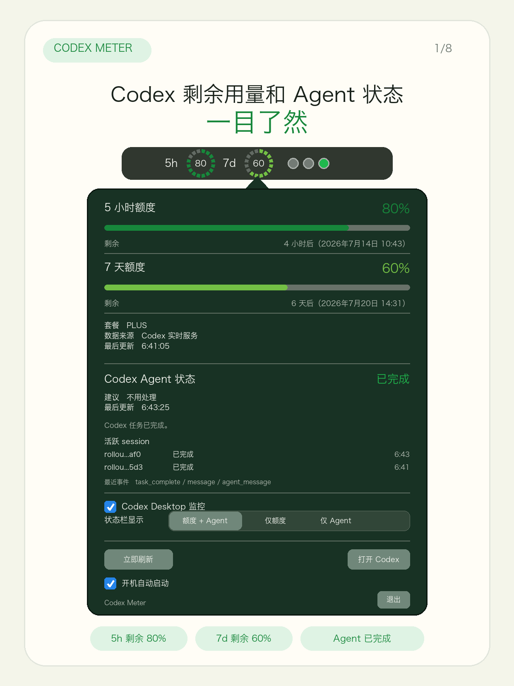
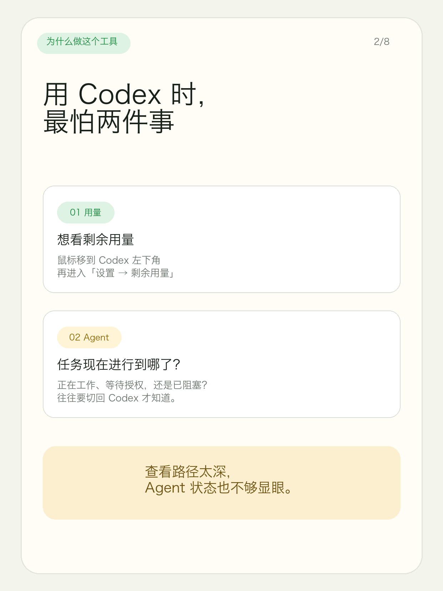
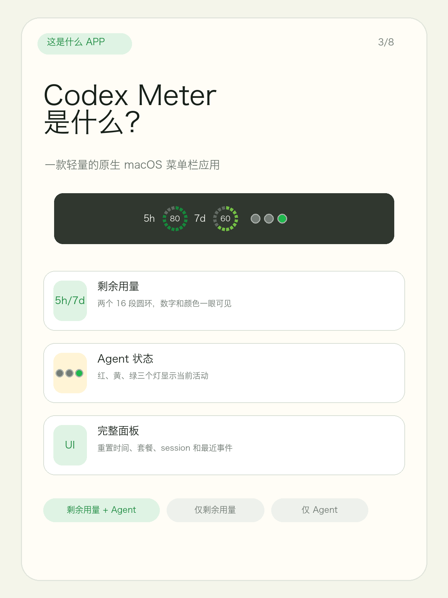
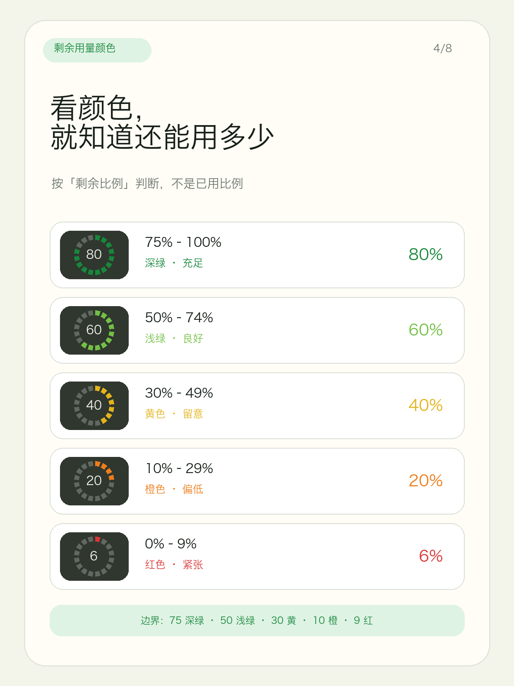
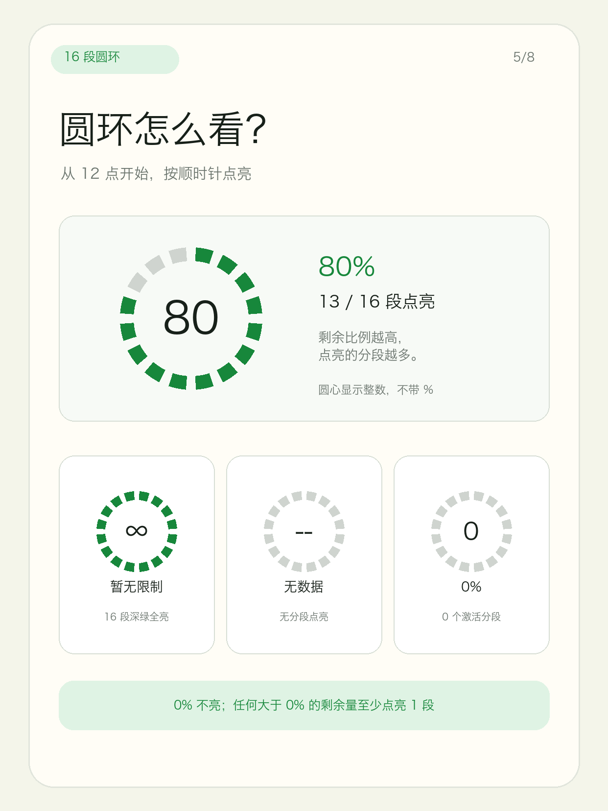
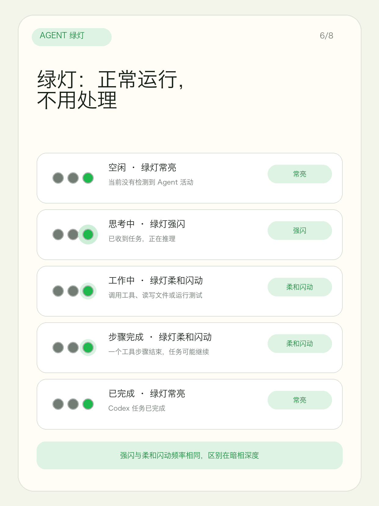
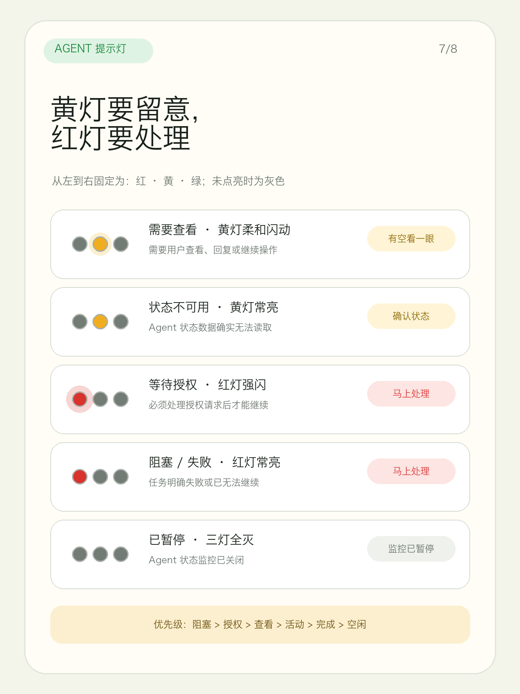
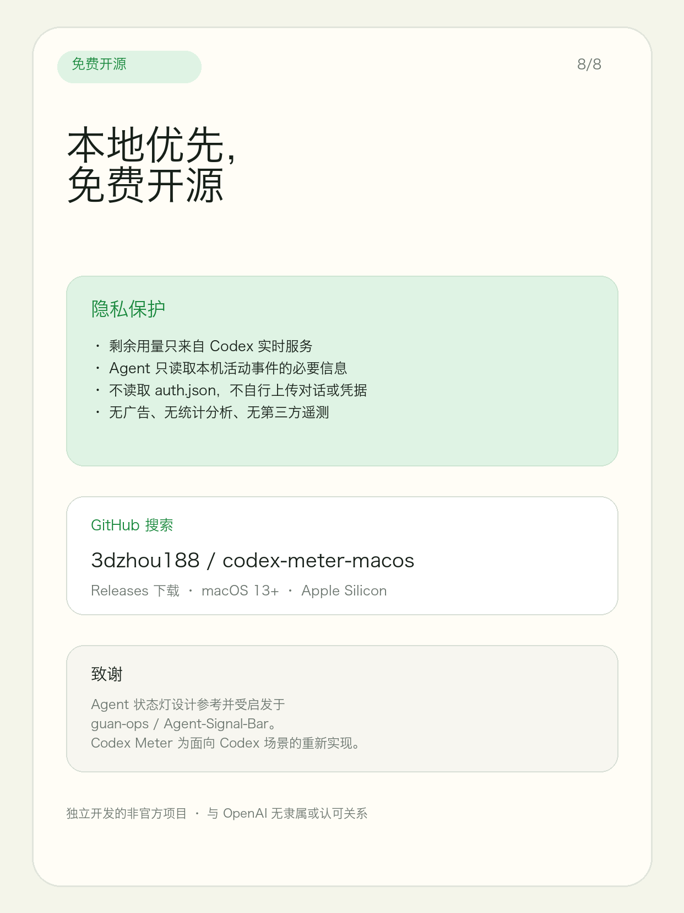

# Codex Meter for macOS

[中文](#中文) | [English](#english)

> An unofficial, native macOS menu bar app for monitoring Codex usage limits and Codex Agent activity.

<p align="center">
  
</p>

[额度圆环与 Agent 状态灯显示规则](docs/DISPLAY_RULES.md)

## 中文

Codex Meter 是一款轻量的原生 macOS 菜单栏应用，用两个彩色分段圆环实时显示 Codex **5 小时额度**和 **7 天额度**的剩余百分比，并用三色状态灯展示 Codex Agent 当前活动状态。

下方图文展示了产品用途、额度圆环颜色阈值、16 段顺时针绘制规则，以及 Codex Agent 在空闲、思考、工作、需查看、等待授权、阻塞和状态不可用等场景下的灯语。

### 图文介绍

<p align="center">
  
  
</p>
<p align="center">
  
  
</p>
<p align="center">
  
  
</p>
<p align="center">
  
</p>

### 功能

- 菜单栏同时显示 5 小时和 7 天剩余额度
- 按剩余比例自动变色：绿色、浅绿、黄色、橙色、红色
- 展示额度重置时间、套餐类型和数据更新时间
- 显示 Codex Agent 状态灯：空闲、思考中、工作中、完成、需查看、等待授权、阻塞、状态不可用或暂停
- 状态栏显示模式可切换：额度 + Agent、仅额度、仅 Agent
- 额度低于阈值时发送 macOS 通知
- 支持开机自动启动和手动刷新
- 仅通过 Codex 实时服务获取额度数据
- 默认读取 `~/.codex/sessions/**/*.jsonl` 的活动事件用于 Agent 状态判断，明确忽略 `token_count`
- 不包含广告、统计分析或第三方遥测

### 系统要求

- macOS 13 Ventura 或更高版本
- 已安装并登录 Codex 桌面应用或 Codex CLI
- Apple Silicon Mac；其他架构可自行从源码构建

### 安装

从 GitHub Releases 下载最新版本，解压后将 `Codex Meter.app` 移入“应用程序”文件夹。

当前发布包采用临时签名，首次打开时可能需要在 Finder 中右键应用并选择“打开”。
如果 macOS 仍提示“无法打开”或“已损坏”，请执行：

```bash
xattr -dr com.apple.quarantine "/Applications/Codex Meter.app"
open "/Applications/Codex Meter.app"
```

这是因为当前开源发布包尚未使用 Apple Developer ID 签名并公证。

### 从源码构建

需要 Xcode 及 Swift 6 工具链：

```bash
git clone https://github.com/3dzhou188/codex-meter-macos.git
cd codex-meter-macos
./scripts/build-app.sh
```

生成的应用位于 `dist/Codex Meter.app`。

运行测试：

```bash
swift test
```

### 数据来源与隐私

- Codex app-server 的 `account/rateLimits/read` 和额度更新通知
- `~/.codex/sessions/**/*.jsonl` 中的 Codex 活动事件类型、session id 和时间戳，仅用于 Agent 状态灯

额度统计仍只来自 Codex 实时服务，不会从本地 session 文件计算额度。应用不会读取 `~/.codex/auth.json`，也不会自行上传提示词、会话内容或账户凭据。详见 [隐私说明](PRIVACY.md)。

### 可选 Codex Hook

发布包内包含轻量 helper：`Codex Meter.app/Contents/Resources/codex-meter-agent`。Codex hook 可把事件 JSON 通过 stdin 传给：

```bash
codex-meter-agent codex-hook UserPromptSubmit
codex-meter-agent codex-hook PreToolUse
codex-meter-agent codex-hook PermissionRequest
codex-meter-agent codex-hook Stop
```

状态文件默认写入 `~/Library/Application Support/Codex Meter/agent-status.json`，可用 `CODEX_METER_AGENT_STATE_FILE` 覆盖路径。

### 参与贡献

欢迎提交 Issue 和 Pull Request。开始前请阅读 [贡献指南](CONTRIBUTING.md)、[安全政策](SECURITY.md)与[行为准则](CODE_OF_CONDUCT.md)。

### 致谢

Codex Agent 状态灯功能参考并受启发于 [Agent Signal Bar](https://github.com/guan-ops/Agent-Signal-Bar) 的本地优先 AI Agent 三色信号灯设计。Codex Meter 中的实现限定为 Codex 场景，并按本项目代码结构重新实现；不包含 Agent Signal Bar 的图片、声音、图标、截图、品牌素材或应用资源。详见 [NOTICE](NOTICE)。

## English

Codex Meter is a lightweight native macOS menu bar app that displays the remaining percentage of your Codex **5-hour** and **7-day** usage windows with two segmented, color-coded rings, plus a traffic-light status indicator for Codex Agent activity.

The overview image shows the quota-ring color thresholds and the Codex Agent traffic-light states for ready, thinking, working, attention, permission, blocked, and unavailable activity.

### Features

- Shows both 5-hour and 7-day remaining usage in the menu bar
- Changes color automatically from green to red as usage runs low
- Displays reset times, plan type, data source, and last update time
- Shows Codex Agent activity: idle, thinking, working, done, attention, permission, blocked, unavailable, or paused
- Supports menu bar display modes: usage + Agent, usage only, or Agent only
- Sends macOS notifications when remaining usage crosses thresholds
- Supports launch at login and manual refresh
- Uses only the Codex app-server for usage data
- Reads Codex activity events from `~/.codex/sessions/**/*.jsonl` by default and explicitly ignores `token_count`
- No ads, analytics, or third-party telemetry

### Requirements

- macOS 13 Ventura or later
- Codex desktop app or Codex CLI installed and signed in
- Apple Silicon Mac; other architectures can build from source

### Installation

Download the latest archive from GitHub Releases, extract it, and move `Codex Meter.app` to your Applications folder.

Release builds are currently ad-hoc signed. On first launch, you may need to right-click the app in Finder and choose **Open**.
If macOS still says the app cannot be opened or is damaged, run:

```bash
xattr -dr com.apple.quarantine "/Applications/Codex Meter.app"
open "/Applications/Codex Meter.app"
```

This is required because the current open-source release is not yet signed with an Apple Developer ID certificate and notarized.

### Build From Source

Xcode and a Swift 6 toolchain are required:

```bash
git clone https://github.com/3dzhou188/codex-meter-macos.git
cd codex-meter-macos
./scripts/build-app.sh
```

The built app is created at `dist/Codex Meter.app`.

Run the tests with:

```bash
swift test
```

### Data and Privacy

- Codex app-server `account/rateLimits/read` responses and update notifications
- Codex activity event types, session ids, and timestamps from `~/.codex/sessions/**/*.jsonl`, used only for the Agent status light

Usage limits are still calculated only from the Codex realtime service, never from local session files. The app does not read `~/.codex/auth.json`, or independently upload prompts, conversations, or account credentials. See [Privacy](PRIVACY.md) for details.

### Optional Codex Hook

Release builds include a lightweight helper at `Codex Meter.app/Contents/Resources/codex-meter-agent`. Codex hooks can pass event JSON through stdin:

```bash
codex-meter-agent codex-hook UserPromptSubmit
codex-meter-agent codex-hook PreToolUse
codex-meter-agent codex-hook PermissionRequest
codex-meter-agent codex-hook Stop
```

The state file defaults to `~/Library/Application Support/Codex Meter/agent-status.json`. Override it with `CODEX_METER_AGENT_STATE_FILE` when needed.

### Contributing

Issues and pull requests are welcome. Please read the [Contributing Guide](CONTRIBUTING.md), [Security Policy](SECURITY.md), and [Code of Conduct](CODE_OF_CONDUCT.md) first.

### Acknowledgements

The Codex Agent status light feature is inspired by [Agent Signal Bar](https://github.com/guan-ops/Agent-Signal-Bar) and its local-first red/yellow/green signal-light design for AI agents. Codex Meter's implementation is scoped to Codex and reimplemented in this project's own structure; it does not include Agent Signal Bar images, sounds, icons, screenshots, brand assets, or app resources. See [NOTICE](NOTICE).

## Disclaimer

Codex Meter is an independent, unofficial project. It is not affiliated with, endorsed by, or supported by OpenAI. Codex and OpenAI are trademarks of their respective owners.

## License

Released under the [MIT License](LICENSE). Third-party attribution notes are recorded in [NOTICE](NOTICE).
